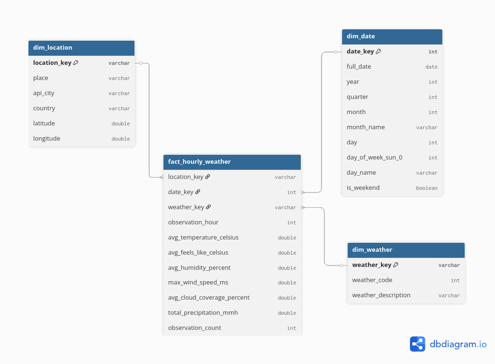
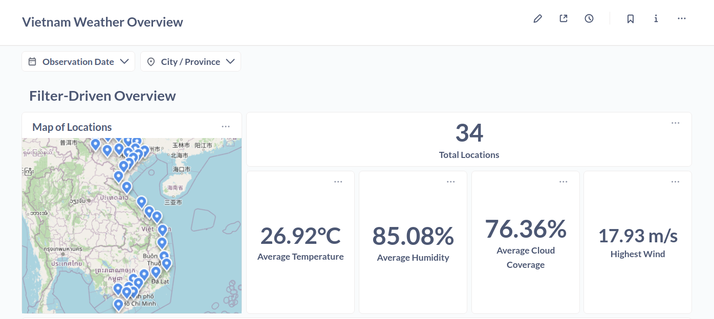
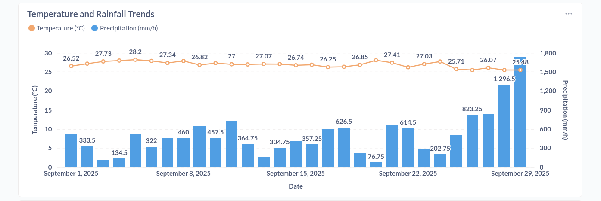
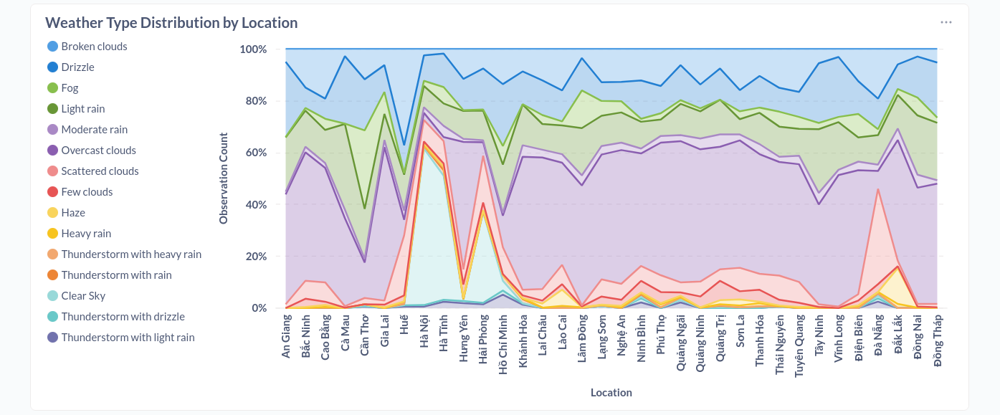
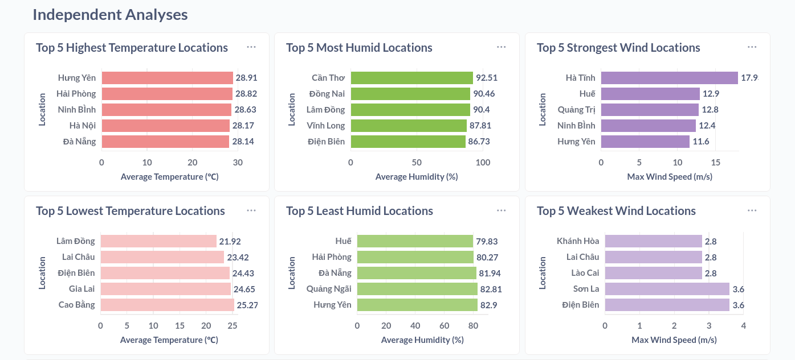
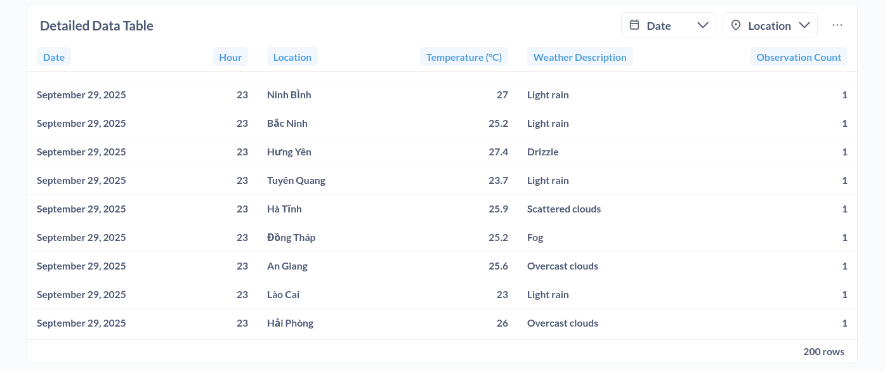
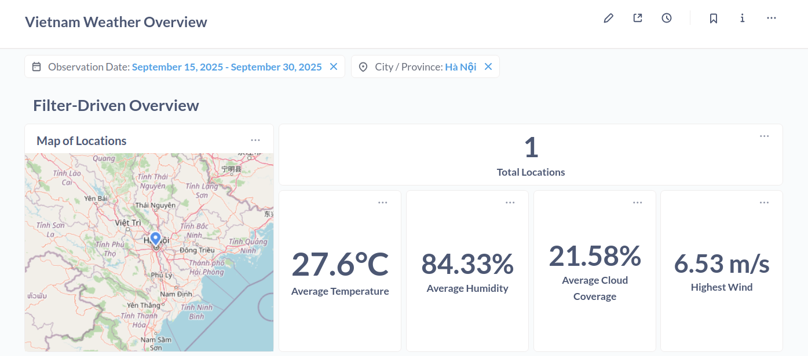
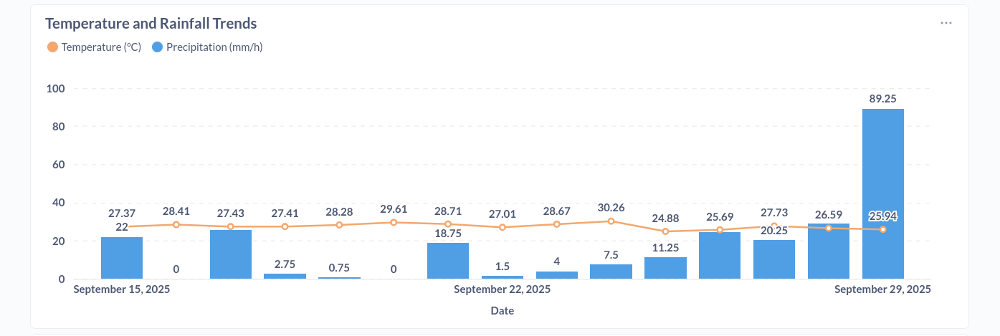
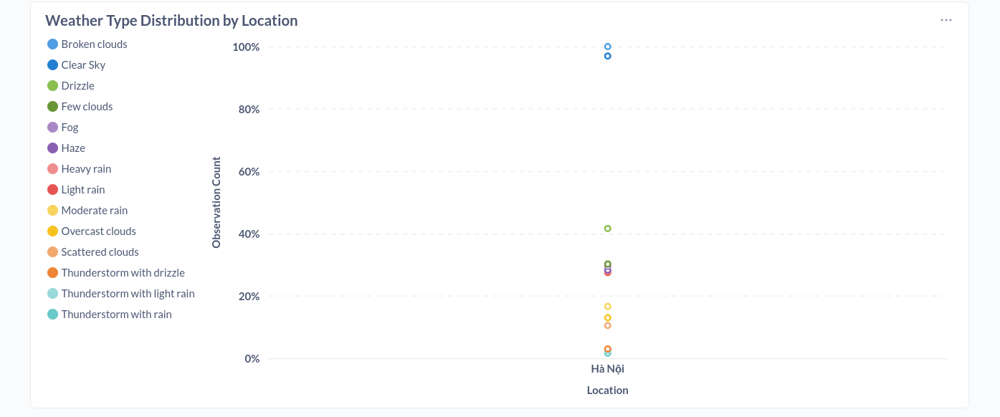

# Geo Weather Lake

[](https://www.python.org/)
[](https://pandas.pydata.org/)
[](https://delta.io/)
[](https://duckdb.org/)
[](https://www.getdbt.com/)
[](https://arrow.apache.org/)
[](https://airflow.apache.org/)
[](https://www.metabase.com/)
[](https://www.docker.com/)

Geo Weather Lake is a comprehensive end-to-end Data Engineering project that extracts, models, and visualizes weather data from the Weatherbit API. It implements a robust Lakehouse architecture using the Medallion design pattern (Bronze, Silver, Gold), featuring automated orchestration, geospatial enrichment, and data governance best practices.

---

## Table of Contents

1. [Overview](#1-overview)
2. [Problem Statement & Goals](#2-problem-statement-and-project-goals)
3. [Architecture & Tech Stack](#3-architecture-and-tech-stack)
4. [Data Modeling](#4-data-modeling---star-schema)
5. [Key Features](#5-key-features)
6. [Dashboard](#6-dashboard)
7. [Project Structure](#7-project-structure)
8. [Setup & Installation](#8-setup--installation)
9. [How to Reproduce](#9-how-to-reproduce)
10. [Future Roadmap](#10-future-roadmap)

---

## 1. Overview

This project builds a scalable data pipeline that ingests weather data (both historical and near real-time) for 34 administrative units in Vietnam. It leverages OpenStreetMap (Nominatim) for geospatial enrichment and Weatherbit API for meteorological data.

The system transforms raw JSON data into a high-performance Analytical Engine using DuckDB reading directly from Delta Lake tables stored in MinIO, culminating in an interactive Metabase dashboard.

---

## 2. Problem Statement and Project Goals

### The Challenge

Weather data is often volatile, scattered across different sources, and difficult to analyze historically alongside real-time trends. Businesses and analysts need a centralized system to answer questions like: "How does the current temperature compare to the 7-day average?" or "Which region in Vietnam is currently experiencing extreme wind conditions?"

### Project Goals

- Scalability: Build a containerized infrastructure that can scale.
- Automation: Eliminate manual intervention for hourly data ingestion.
- Data Quality: Ensure consistency between historical backfills and real-time streams.
- Insight: Provide actionable insights through a clean dimensional model.

### Key Business Questions

1.  Trends: How have temperature and humidity changed over the last 24 hours or 7 days across Vietnam?
2.  Comparison: Which city is currently the hottest, coldest, or windiest?
3.  Distribution: What is the frequency of different weather conditions (Rain, Clear, Clouds)?
4.  Coverage: Are we collecting stable data for all targeted locations?

---

## 3. Architecture and Tech Stack

### Architecture

The project follows the _Medallion Architecture_ (Bronze $\to$ Silver $\to$ Gold), hosted entirely on _Docker_ and orchestrated by _Apache Airflow_.


### Tech Stack Decisions

| Category            | Technology                | Purpose                                   | Why this choice?                                                                  |
| :------------------ | :------------------------ | :---------------------------------------- | :-------------------------------------------------------------------------------- |
| Ingestion           | Python (Requests, Pandas) | Extract data from APIs.                   | Flexibility to handle rate limits and pagination logic.                           |
| Enrichment          | Nominatim (OSM)           | Geocoding (Province -> Lat/Lon).          | Open-source, reliable standard for geospatial data.                               |
| Storage (Data Lake) | MinIO (S3 Compatible)     | Store Bronze (Raw) & Silver (Clean) data. | Simulates cloud object storage locally; decoupling storage from compute.          |
| Format              | Delta Lake                | Table format for Lakehouse.               | ACID transactions, schema enforcement, and time-travel capabilities.              |
| Transformation      | Pandas (Silver)           | Cleaning & Normalization.                 | Powerful for complex JSON parsing and deduplication logic.                        |
| Transformation      | dbt (Gold)                | Data Modeling (SQL).                      | Best-in-class for T (Transform), testing, documentation, and lineage.             |
| Query Engine        | DuckDB                    | OLAP Query Engine.                        | Fast in-process SQL analytics on Parquet/Delta files; serverless.                 |
| Orchestration       | Apache Airflow            | Scheduling & Dependency Management.       | Industry standard for managing complex DAG dependencies (Controller DAG pattern). |
| Visualization       | Metabase                  | BI Dashboard.                             | User-friendly, open-source, and excellent DuckDB support.                         |
| Infrastructure      | Docker                    | Containerization.                         | Reproducibility and easy deployment.                                              |

---

## 4. Data Modeling - Star Schema

The Gold layer is designed using Dimensional Modeling (Star Schema) to optimize for analytical queries in BI tools.



- Fact Table (`fact_hourly_weather`): Central table containing quantitative metrics at the hourly grain per location.
- Dimension Tables:
  - `dim_location`: Standardized location data.
  - `dim_date`: Date attributes for trend analysis.
  - `dim_weather`: Descriptive weather conditions.

This model allows for fast aggregations (e.g., "Average temperature by City") and simple filtering in Metabase.

---

## 5. Key Features

- Geospatial Enrichment: Automatically extracts coordinates for administrative boundaries using OpenStreetMap.
- Hybrid Ingestion Strategy:
  - _Historical:_ Bulk backfill via optimized Jupyter Notebooks.
  - _Current:_ Hourly incremental ingestion via Airflow.
- Automated ELT Pipeline: A "Controller DAG" orchestrates the flow: Ingest $\to$ Transform (Silver) $\to$ Model (dbt Gold).
- Data Quality Checks: Integrated `dbt test` ensures uniqueness, referential integrity, and valid value ranges.
- Deduplication Logic: Handling of duplicate records based on location and timestamp priorities.

---

## 6. Dashboard

An interactive Metabase dashboard provides real-time insights.

### Overview







### Key Features

1.  Interactive Filters: Filter by Time Range and Location (Province).
    
    
    
2.  Geospatial Map: Pin map visualization of weather metrics across Vietnam.
3.  Comparative Analysis: "Top 5 Locations" bar charts.

---

## 7. Project Structure

```bash
.
├── airflow/
│   ├── dags/               # Airflow DAGs (Controller, Ingest, Transform, dbt)
│   ├── extensions/         # DuckDB extensions for offline installation
│   └── Dockerfile          # Custom Airflow image with DuckDB/dbt
├── assets/                 # Images for documentation
├── dbt/weather_analytics/  # dbt project (Marts, Staging, Tests)
├── docker-compose.yaml     # Infrastructure definition
├── metabase/               # Custom Metabase Dockerfile (Debian-based)
├── notebooks/              # Jupyter Notebooks for exploration & historical ingest
├── resources/              # Input CSVs (Boundaries, Locations)
└── scripts/                # Python ELT scripts (Ingest, Transform)
```

---

### 8. Setup & Installation

#### Prerequisites

- Docker installed (Docker Desktop is recommended).
- Python 3.11 (for local scripts/notebooks).
- **Weatherbit API Key**: Sign up for a free trial (Business Plan trial allows 1500 requests/day).

#### Step 1: Clone the Repository

```bash
git clone https://github.com/tanmaivan/geo-weather-lake.git
cd geo-weather-lake
```

#### Step 2: Configure Environment Variables

Create a `.env` file in the root directory with the following credentials:

```bash
# MinIO Config
MINIO_ROOT_USER=minio
MINIO_ROOT_PASSWORD=minio123
# Use http://minio:9000 inside containers, http://localhost:9000 on host
MINIO_ENDPOINT=http://minio:9000

# AWS Access for S3 Libraries
AWS_ACCESS_KEY_ID=minio
AWS_SECRET_ACCESS_KEY=minio123

# Airflow User ID (Linux)
AIRFLOW_UID=50000

# Weatherbit API
WEATHERBIT_API_KEY=your_api_key_here
```

#### Step 3: Build Docker Images Manually

Since the `docker-compose.yml` relies on pre-built local images, you need to build them first:

```bash
# Build custom Airflow image (with DuckDB extensions baked in)
docker build --no-cache -t local-airflow:latest ./airflow

# Build custom Metabase image (Debian-based for DuckDB support)
docker build --no-cache -t local-metabase:latest ./metabase
```

#### Step 4: Start Infrastructure

Once images are built, start the services:

```bash
docker-compose up -d
```

_Wait a few minutes for Airflow and Metabase to fully initialize._

#### Step 5: Setup Local Environment (Optional)

If you want to run notebooks or initialization scripts from your local machine (outside Docker), set up a Python environment:

```bash
# Using Conda
conda create --prefix ./venv python=3.11 -y
conda activate ./venv

# Install dependencies
pip install -r requirements.txt
```

#### Step 6: Initialize Data Lake Buckets

Create the `weather-bronze`, `weather-silver` buckets in MinIO:

```bash
# Run this from your local environment
python scripts/create_buckets.py
# Or execute it inside the container (ensure MINIO_ENDPOINT is minio:9000; if it’s set to localhost by default, change it in the cell):
# docker exec -it airflow-scheduler python /opt/airflow/scripts/create_buckets.py
```

#### Step 7: Configure dbt

Ensure dbt can connect to the database:

```bash
cd dbt/weather_analytics

# Install dbt dependencies
dbt deps

# Check connection
dbt debug
```

### Accessing Services

- Airflow UI: [http://localhost:8080](http://localhost:8080) (User/Pass: `airflow`/`airflow`)
- MinIO Console: [http://localhost:9001](http://localhost:9001) (User/Pass: `minio`/`minio123`)
- Metabase: [http://localhost:3000](http://localhost:3000) (User/Pass created during setup)

---

## 9. How to Reproduce

To replicate this project from scratch, I have prepared detailed step-by-step guides covering every phase of the engineering lifecycle. Follow them in order:

- **[1: Planning & Setup](./docs/guides/01-planning.md)**

- **[2: Data Ingestion (Bronze)](./docs/guides/02-ingestion.md)**

- **[3: Data Transformation (Silver)](./docs/guides/03-transformation.md)**

- **[4: Data Modeling (Gold)](./docs/guides/04-data-modeling.md)**

- **[5: Visualization & Dashboard](./docs/guides/05-visualization.md)**

---

## 10. Future Roadmap

While the current pipeline is robust, there is always room for improvement. Here is what's next:

- Incremental Loading: Switch Silver and Gold layers from `overwrite` to `incremental` merge logic for better performance at scale.
- CI/CD: Integrate GitHub Actions to automatically run `dbt test` and linters on Pull Requests.
- Alerting: Configure Airflow Slack/Email callbacks for DAG failures.
- New Data Sources: Integrate Forecast API to compare predictions vs. actuals.

---
