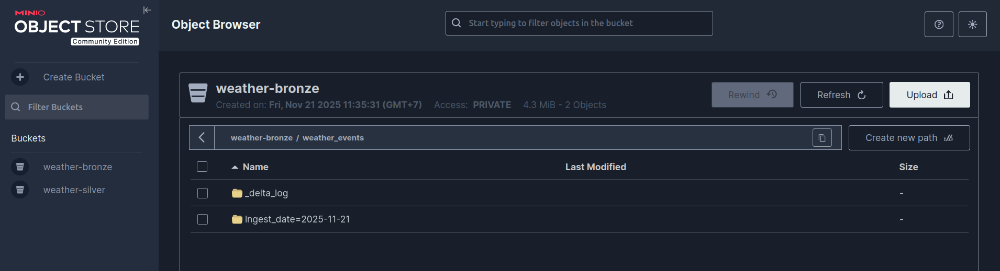

# Guide 02: Data Ingestion (Bronze Layer)

This guide details the Extract and Load phases of the pipeline. We acquire weather data from external APIs and store it in the Bronze Layer (MinIO) using the Delta Lake format.

## 1. Strategy & Architecture

### The Bronze Layer Philosophy

The Bronze layer is the Landing Zone. The goal is to capture data in its rawest form to ensure no information is lost and to allow for re-processing if logic changes later.

- Format: Delta Lake (Parquet files + Transaction Log).
- Schema strategy: Minimalist. We store the full API response in a `raw_payload` JSON column to handle schema drift or differences between APIs flexibly.
- Write Mode: `Append` only.

### Ingestion Flows

We implement a hybrid ingestion strategy:

1.  **Historical Backfill**: A manual, one-off process using Jupyter Notebooks to fetch past data (e.g., last 7-30 days) for all provinces.
2.  **Current Stream**: An automated, hourly process using Python scripts triggered by Airflow to fetch real-time data.

---

## 2. Prerequisites

Before running any code, ensure you have the following:

1.  **MinIO Buckets**: You must create the required buckets in MinIO. You can do this manually via the MinIO Console (http://localhost:9001) or run the provided script:

    ```bash
    # Run from your local machine
    python scripts/create_buckets.py
    ```

    _Required buckets:_ `weather-bronze`, `weather-silver`.

2.  **Input Data**: A CSV file containing the list of locations you want to track. For this project, we use a list of Vietnam Provinces, but the logic **works** for any list of locations (wards, districts, etc.) as long as the CSV has a `name` column.

---

## 3. Phase 1: Data Preparation (Geocoding)

To fetch weather data, we first need the coordinates (Latitude/Longitude) for our target locations.

- Goal: Convert a list of place names into a geocoded CSV file.
- Tool: Jupyter Notebooks (Preferred for this step due to its interactive nature and ease of debugging).

### Step 3.1: Extract Locations

_Run notebook: `notebooks/01_extract_provinces.ipynb`_

We extract unique province names from a raw administrative boundary file (`VietnamWardBoundary2025.csv`) to create a clean list of targets.

### Step 3.2: Geocoding via OpenStreetMap

_Run notebook: `notebooks/02_geocode_provinces.ipynb`_

We use the Nominatim API to find coordinates.

- Input: `resources/vietnam_provinces.csv` (Column: `name`)
- Output: `resources/vietnam_provinces_geocoded.csv` (Columns: `name`, `latitude`, `longitude`)

Important Note: Nominatim is a free service with a strict usage policy. The notebook includes a `time.sleep(1.1)` delay between requests to respect the 1 request/second limit.

---

## 4. Phase 2: Historical Ingestion (Backfill)

_Run notebook: `notebooks/03_ingest_historical.ipynb`_

This step populates the data lake with historical context. Since historical data ingestion often hits API rate limits or requires custom date ranges, it is best run manually via a Notebook rather than an automated DAG.

### Key Logic: Merging Metadata

The Historical API returns data in a nested format where metadata (City, Lat, Lon) is separate from the time-series data. To match the schema of the "Current" API (where metadata is often implicit or part of the request), we manually inject the `place_name` into every observation record before saving.

---

## 5. Phase 3: Current Ingestion (Automated)

This pipeline runs hourly to keep the Data Lake fresh. We develop the logic in a Python script (`.py`) to be executed by Airflow.

> Tip: It is highly recommended to prototype this logic in a Notebook first to verify the API response structure before finalizing the Python script.

Source Code: `scripts/ingest_weather.py`

### 5.1. The Script Logic

The script performs three main actions:

1.  Read Config: Loads target locations from `resources/vietnam_provinces_geocoded.csv`.
2.  Fetch API: Calls Weatherbit Current Weather API.
    - _Enrichment:_ Injects `place_name` from our local CSV into the API response record. This ensures that we rely on _our_ standardized location names, not the variable city names returned by the API.
3.  Write to Bronze: Appends to the same `weather_events` Delta table used by the historical ingestion.

### 5.2. Schema Consistency Strategy

To handle differences between Historical and Current API responses, we use a flexible schema strategy for the Bronze layer:

```python
record = {
    "observation_id": make_observation_id(...), # Deterministic ID for deduplication
    "source": "weatherbit_current",             # Traceability
    "raw_payload": json.dumps(observation_data),# Store everything as JSON
    "_ingested_at": datetime.now(timezone.utc)
}
```

---

## 6. Orchestration (Airflow)

We wrap the ingestion script in an Airflow DAG.

File: `airflow/dags/ingest_weather_dag.py`

```python
from airflow.sdk import DAG
from airflow.providers.standard.operators.python import PythonOperator
from datetime import datetime, timedelta
import sys
from pathlib import Path

# Add scripts directory to path so Airflow can import the function
scripts_path = Path(__file__).resolve().parents[1] / "scripts"
if str(scripts_path) not in sys.path:
    sys.path.append(str(scripts_path))

try:
    from ingest_weather import run_ingestion
except ImportError as e:
    raise ImportError(f"Could not import run_ingestion from ingest_weather.py: {e}")

default_args = {
    "depends_on_past": False,
    "retries": 1,
    "retry_delay": timedelta(minutes=5),
}

with DAG(
    "ingest", # DAG ID used by the Controller
    default_args=default_args,
    start_date=datetime(2025, 1, 1),
    catchup=False,
    schedule=None, # Triggered by Controller DAG, so no schedule here
    description='A DAG to ingest current weather data from Weatherbit API to the Bronze layer.',
    tags=['bronze', 'ingestion', 'child'],
) as dag:
    ingestion_task = PythonOperator(
        task_id='fetch_transform_load_to_bronze',
        python_callable=run_ingestion
    )
```

---

## 7. Verification

To verify that data has been successfully ingested:

- Go to `http://localhost:9001`.
- Bucket: `weather-bronze`.
- Path: `weather_events/`.
- Check for partition folders (e.g., `ingest_date=2025-11-21`) and Parquet files.



---

Next Step: Silver Layer: Cleaning, Deduplication & Schema Standardization

< [Back to Planning](01-planning.md) | [Next: Transformation >](03-transformation.md)
