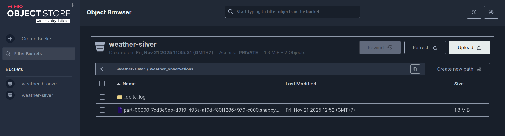

# Guide 03: Data Transformation (Silver Layer)

This guide focuses on the Transformation phase (the first "T" in ELT). Here, we take raw, unstructured data from the Bronze Layer, clean it, standardize its schema, and enrich it with new features to create a reliable Silver Layer.

## 1. Strategy & Architecture

### The Silver Layer Philosophy

The Silver layer represents Cleaned and Conformed Data. It serves as the single source of truth for downstream analytics (Gold layer).

- Tools: Python & Pandas (for complex logic), Delta Lake (storage).
- Key Actions:
  - Parsing: Flattening JSON payloads into structured columns.
  - Standardization: Enforcing data types (timestamps, floats) and column naming conventions.
  - Deduplication: Removing duplicate records based on business keys (`place` + `timestamp`).
  - Enrichment: Calculating derived features (e.g., `wind_category`, `day_of_week`).
- Write Mode: `Overwrite` (Full Refresh). Given the data volume, reprocessing the entire Silver layer ensures consistency and handles any schema evolution gracefully.

### Schema Evolution Handling

Since we ingest data from two sources (Historical and Current APIs) with slightly different fields, the Silver transformation acts as the unifier. It explicitly defines a target schema and fills missing columns with `null` to ensure a consistent table structure.

---

## 2. Transformation Logic (Python & Pandas)

The core logic is encapsulated in `scripts/transform_to_silver.py`.

> Development Tip:
> It is highly recommended to prototype this transformation logic in a Jupyter Notebook (`notebooks/transform_to_silver.ipynb`) before finalizing the script. This allows you to inspect dataframes interactively.

### 2.1. Parsing & Flattening

The Bronze table stores data in a `raw_payload` JSON column. We parse this into a flat DataFrame.

```python
# Logic Highlight
payload_df = df['raw_payload'].apply(lambda x: json.loads(x)).apply(pd.Series)
weather_df = payload_df['weather'].apply(pd.Series) # Flatten nested weather object
```

### 2.2. Schema Standardization

We define a Target Schema (`final_silver_columns`) containing every column we expect in the Silver layer.

- Column Mapping: We map raw API names (e.g., `wind_spd`, `pres`) to business-friendly names (`wind_speed`, `pressure`).
- Missing Column Handling: If a column (e.g., `aqi` from historical data) is missing, we create it with `None` values.

```python
# Logic Highlight: Enforcing Schema
for col in final_silver_columns:
    if col not in df.columns:
        df[col] = None # Fill missing columns
df = df[final_silver_columns] # Reorder columns to match schema
```

### 2.3. Deduplication

We remove duplicate observations that might occur due to overlapping API calls.

- Key: `place` (Location Name) + `observation_hour` (YYYY-MM-DD-HH).
- Strategy: Sort by `ingested_at` and keep the first (most recent) record.

### 2.4. Feature Engineering

We add valuable derived columns for analytics:

- `observation_hour`, `day_of_week`, `month` (Time dimensions).
- `wind_category`: Categorizing wind speed into "Calm", "Breeze", "Gale" using bins.
- `uv_category`: Categorizing UV index levels.

---

## 3. Writing to Delta Lake

To avoid schema errors (like "Invalid data type: Null"), we explicitly define the PyArrow Schema when writing to Delta Lake. This forces columns with all-null values to have a specific type (e.g., `double`).

```python
# Logic Highlight: Explicit Schema Definition
silver_schema = pa.schema([
    ('temperature', pa.float64()),
    ('aqi', pa.float64()), # Forces float type even if all values are null
    ('observed_at', pa.timestamp('us', tz='UTC')),
    # ... other fields
])

arrow_table = pa.Table.from_pandas(df, schema=silver_schema)
write_deltalake(..., schema_mode="overwrite", ...)
```

---

## 4. Orchestration (Airflow)

This transformation script is automated via an Airflow DAG.

File: `airflow/dags/transform_dag.py`

```python
from airflow.sdk import DAG
from airflow.providers.standard.operators.python import PythonOperator
from datetime import datetime, timedelta
import sys
from pathlib import Path

# Import logic from scripts folder
scripts_path = Path(__file__).resolve().parents[1] / "scripts"
sys.path.append(str(scripts_path))
from transform_to_silver import run_transformation

default_args = {
    "depends_on_past": False,
    "retries": 1,
    "retry_delay": timedelta(minutes=5),
}

with DAG(
    "transform", # DAG ID used by Controller
    default_args=default_args,
    start_date=datetime(2025, 1, 1),
    catchup=False,
    schedule=None, # Triggered by Controller DAG
    description='A DAG to transform raw weather data from Bronze to Silver.',
    tags=['silver', 'transformation', 'child'],
) as dag:

    transformation_task = PythonOperator(
        task_id='run_bronze_to_silver_transformation',
        python_callable=run_transformation
    )
```

---

## 5. Verification

To verify the Silver layer, check the `weather-silver` bucket for the `weather_observations` table.



---

Next Step: Gold Layer: Star Schema Modeling with dbt

< [Back to Ingestion](02-ingestion.md) | [Next: Data Modeling >](04-data-modeling.md)
