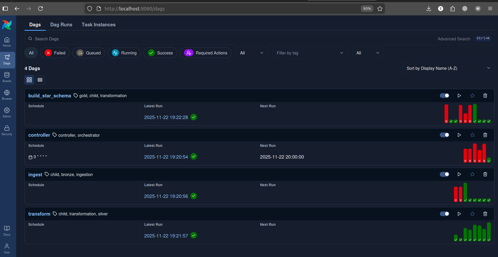
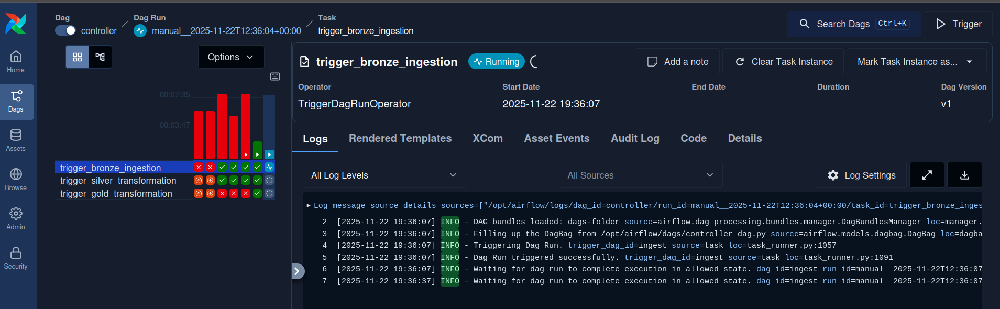
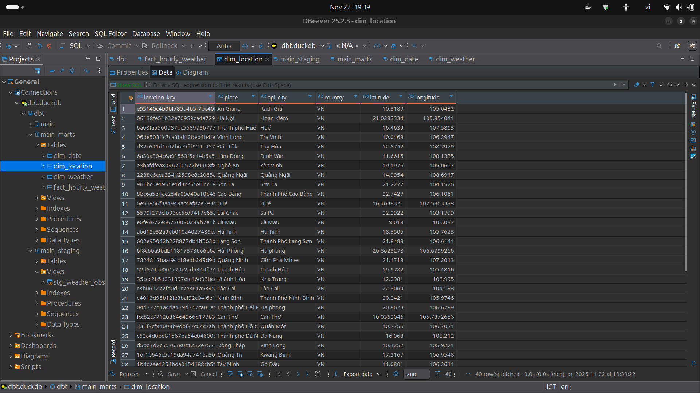

# Guide 04: Data Modeling (Gold Layer)

This guide details the Data Modeling phase. We use dbt (data build tool) to transform the flat Silver table into a Star Schema, utilizing DuckDB as the processing engine.

## 1. dbt Project Initialization

Before writing any SQL, we need to scaffold the dbt project and install dependencies.

### Step 1.1: Initialize Project

Run these commands from your project root (locally or inside the airflow container):

```bash
# Create a directory for dbt
mkdir -p dbt
cd dbt

# Initialize a new dbt project
dbt init weather_analytics
```

Configuration prompts during init:

1.  Database: Select `duckdb`.
2.  Threads: Default is usually fine (1 or 4).
3.  DuckDB Path: Enter `dbt_tmp.duckdb` (See _Atomic Swap Strategy_ below).
4.  Extensions: Leave blank or accept defaults.

### Step 1.2: Install Dependencies

Create a `packages.yml` file in `dbt/weather_analytics/` with the following content to enable surrogate keys and utility macros:

```yaml
packages:
  - package: dbt-labs/dbt_utils
    version: 1.3.2
```

Now, install the packages:

```bash
cd weather_analytics
dbt deps
```

---

## 2. Configuration

**Crucial Architecture Decision**: DuckDB allows only one writer at a time. If Metabase is reading `dbt.duckdb` while Airflow tries to write to it, the pipeline will fail with a "Database Locked" error.

**Solution**: We configure dbt to write to a temporary file (`dbt_tmp.duckdb`) and then instantly swap it with the production file (`dbt.duckdb`) upon success.

### `profiles.yml`

Configure dbt to write to the temporary file.

```yaml
weather_analytics:
  target: dev
  outputs:
    dev:
      type: duckdb
      path: dbt_tmp.duckdb # write to a temp file first
      extensions:
        - httpfs
        - delta
```

### `dbt_project.yml`

Add the `on-run-start` hook to authentication with MinIO.

```yaml
# ... (Project settings)

on-run-start:
  - "{{ s3_setup() }}"

models:
  weather_analytics:
    staging:
      +materialized: view
      +file_format: delta
      +schema: staging
    marts:
      +materialized: table
      +schema: marts
```

### `macros/s3_setup.sql`

```sql

LOAD httpfs;
LOAD delta;

CREATE OR REPLACE SECRET minio_secret (
    TYPE S3,
    KEY_ID '{{ env_var("AWS_ACCESS_KEY_ID") }}',
    SECRET '{{ env_var("AWS_SECRET_ACCESS_KEY") }}',
    ENDPOINT '{{ env_var("MINIO_ENDPOINT") | replace("http://", "") }}',
    URL_STYLE 'path',
    USE_SSL false
);

```

---

## 3. The Data Model (Star Schema)

We implement the logic to build our Fact and Dimensions.

- Staging (`stg_weather_observations.sql`): A View acting as a proxy to the Silver Delta table.
- Dimensions (`dim_*.sql`):
  - `dim_location`: Unique places with coordinates.
  - `dim_date`: Calendar attributes derived from timestamps.
  - `dim_weather`: Unique weather codes and descriptions.
- Fact (`fact_hourly_weather.sql`): Aggregated metrics joined with dimensions using Surrogate Keys.


---

## 4. Orchestration (Airflow)

We use two DAGs here: one to run dbt, and a "Controller" DAG to manage the entire pipeline order.

### 4.1. Gold DAG (`build_star_schema.py`)

This DAG runs the dbt project and performs the Atomic Swap.

File: `airflow/dags/gold_dbt_dag.py`

```python
from airflow.sdk import DAG
from airflow.providers.standard.operators.bash import BashOperator
from datetime import datetime, timedelta

# Path to the dbt project inside the Docker container
DBT_PROJECT_DIR = "/opt/airflow/dbt/weather_analytics"

default_args = {
    "depends_on_past": False,
    "retries": 1,
    "retry_delay": timedelta(minutes=5),
}

with DAG(
    "build_star_schema", # DAG ID
    default_args=default_args,
    start_date=datetime(2025, 1, 1),
    catchup=False,
    schedule=None, # Triggered by Controller
    description='A DAG to build the Star Schema from Silver-layer weather data using dbt.',
    tags=['gold', 'transformation', 'child'],
) as dag:

    dbt_run_task = BashOperator(
        task_id='run_dbt_models',
        # 1. Navigate to project
        # 2. Run dbt models and tests on the TEMP database
        # 3. If successful, atomically move the TEMP file to the PROD file
        bash_command = f"""
            cd {DBT_PROJECT_DIR} && \
            dbt run && \
            dbt test && \
            mv dbt_tmp.duckdb dbt.duckdb
        """,
    )
```

### 4.2. Controller DAG (`controller_dag.py`)

This is the "Conductor" that triggers ingestion, transformation, and finally data modeling.

File: `airflow/dags/controller_dag.py`

```python
from airflow.sdk import DAG
from airflow.providers.standard.operators.trigger_dagrun import TriggerDagRunOperator
from datetime import datetime, timedelta
import sys
from pathlib import Path

default_args = {
    "depends_on_past": False,
    "retries": 0,
}

with DAG(
    "controller",
    default_args=default_args,
    start_date=datetime(2025, 1, 1),
    catchup=False,
    schedule="@hourly", # The only DAG with a schedule
    description='The main controller DAG that orchestrates the entire weather data pipeline.',
    tags=['controller', 'orchestrator'],
) as dag:

    # Task 1: Trigger Bronze Ingestion
    trigger_ingestion = TriggerDagRunOperator(
        task_id='trigger_bronze_ingestion',
        trigger_dag_id="ingest",
        wait_for_completion=True,
        poke_interval=30,
        failed_states=["failed"]
    )

    # Task 2: Trigger Silver Transformation
    trigger_silver_transformation = TriggerDagRunOperator(
        task_id='trigger_silver_transformation',
        trigger_dag_id="transform",
        wait_for_completion=True,
        poke_interval=30,
        failed_states=["failed"]
    )

    # Task 3: Trigger Gold dbt Modeling
    trigger_gold_transformation = TriggerDagRunOperator(
        task_id='trigger_gold_transformation',
        trigger_dag_id="build_star_schema",
        wait_for_completion=True,
        poke_interval=30,
        failed_states=["failed"]
    )

    # Define dependency flow
    trigger_ingestion >> trigger_silver_transformation >> trigger_gold_transformation
```



### Critical Operational Note

For the Controller DAG to function correctly, you must UNPAUSE (Turn On) all the Child DAGs (`ingest`, `transform`, `build_star_schema`) in the Airflow UI.

If a child DAG is "Paused", the Controller will trigger it, but the child will never actually run. The Controller will wait indefinitely (or until timeout), causing the pipeline to hang.

## 

## 5. The `dbt.duckdb` Integration

When `dbt run` executes successfully, it generates or updates the file `dbt/weather_analytics/dbt.duckdb`.

### Why is this file important?

1.  It is the Warehouse: Unlike connecting to a server (like Postgres), DuckDB is a serverless, file-based OLAP database. This file _contains_ your Gold Layer.
2.  Concurrency Management (Atomic Swap):
    - Airflow writes to `dbt_tmp.duckdb`.
    - Metabase reads from `dbt.duckdb`.
    - The Swap: When Airflow finishes, it replaces `dbt.duckdb` with `dbt_tmp.duckdb`. This ensures Metabase never crashes due to a locked database while Airflow is processing.
3.  Integration Points:
    - Metabase: Configured to read `/app/dbt/weather_analytics/dbt.duckdb`.
    - DBeaver: You can connect to this file locally on your host machine (`./dbt/weather_analytics/dbt.duckdb`) for ad-hoc SQL queries.



Note: Because of Docker Volumes, the file inside the container is instantly synced with the file on your local machine.

---

Next Step: Building the Dashboard in Metabase

< [Back to Transformation](03-transformation.md) | [Next: Visualization >](05-visualization.md)
